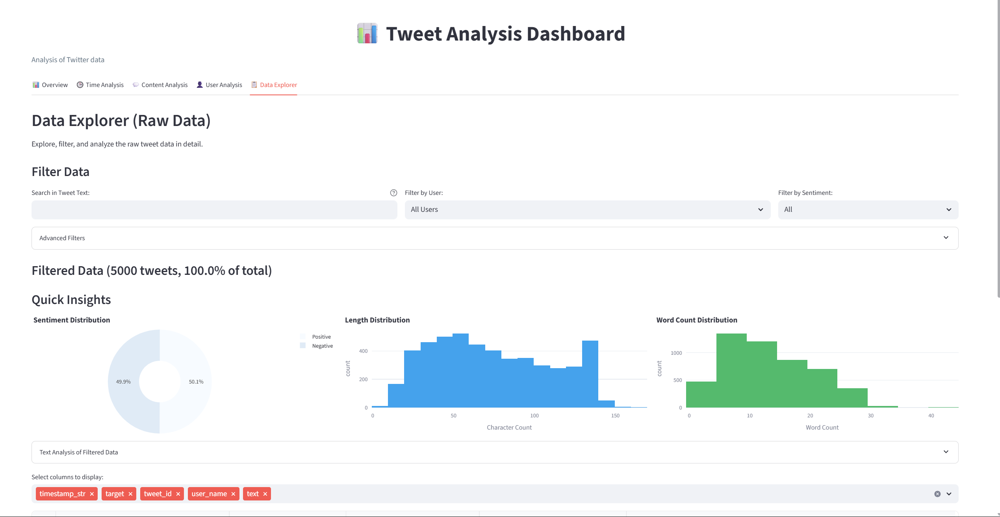
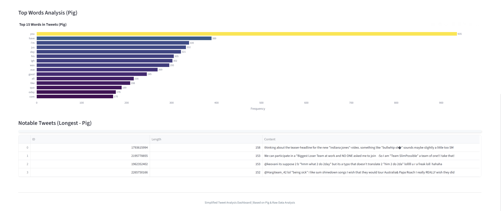
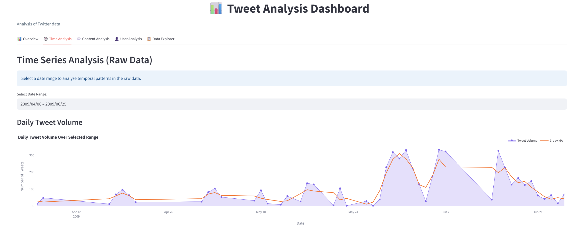
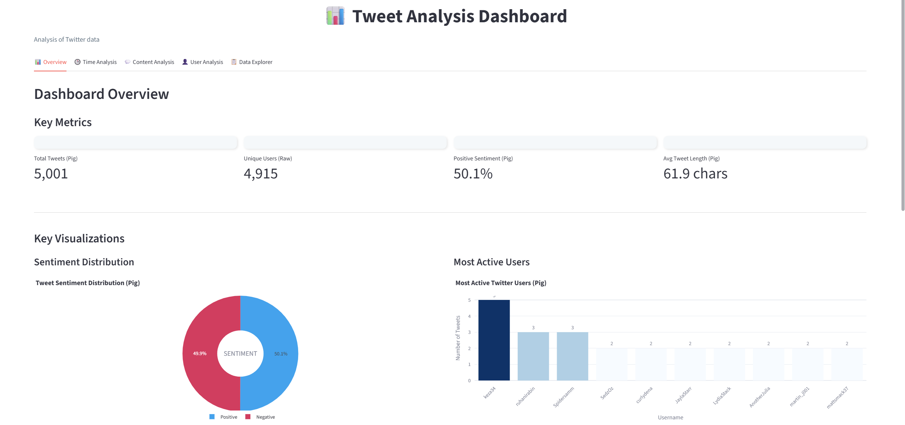

# Twitter Sentiment Analysis using Apache Pig & Streamlit Dashboard

A comprehensive big data project that performs Twitter sentiment analysis using Apache Pig for data processing and features an interactive Streamlit dashboard for visualization and exploration.

## 📊 Project Overview

This project demonstrates big data processing capabilities by:
- **Data Processing**: Using Apache Pig to analyze Twitter data and extract insights
- **Sentiment Analysis**: Analyzing sentiment distribution from tweet target labels
- **Interactive Dashboard**: Built with Streamlit for real-time data exploration
- **Comprehensive Analytics**: Including user activity, content analysis, and temporal patterns

## 🚀 Features

### 📈 Apache Pig Analytics
- **Top Active Users**: Identify most active Twitter users
- **Content Analysis**: Extract longest tweets and average tweet lengths
- **Sentiment Distribution**: Analyze positive vs negative sentiment patterns
- **Word Frequency**: Top 50 most common words analysis

### 🖥️ Interactive Dashboard
- **Overview Tab**: Key metrics and visualizations
- **Time Analysis**: Temporal patterns and activity heatmaps
- **Content Analysis**: Hashtags, mentions, and text patterns
- **User Analysis**: User engagement and activity distribution
- **Data Explorer**: Advanced filtering and data export capabilities

## 📸 Screenshots

### Main Dashboard Overview


### Detailed Analytics



### Time Series Analysis


### Interactive Dashboard


## 🛠️ Technology Stack

- **Big Data Processing**: Apache Pig
- **Frontend**: Streamlit
- **Data Analysis**: Pandas, Plotly
- **Data Visualization**: Plotly Express, Plotly Graph Objects
- **Data Export**: CSV, Excel, JSON formats
- **Package Management**: UV (Python package manager)

## 📁 Project Structure

```
bd_project/
├── app.py                          # Main Streamlit dashboard application
├── analysis.pig                    # Apache Pig script for data processing
├── pre_pre_processing.ipynb        # Data preprocessing notebook
├── pyproject.toml                  # Project dependencies
├── artifacts/                      # Screenshots and visualizations
│   ├── analysis_1.png
│   ├── analysis_2.png
│   ├── dashboard.png
│   ├── overall_dashboard.png
│   └── time-series_analysis_1.png
├── analysis_results/               # Pig analysis outputs
│   ├── analysis_top_users.csv
│   ├── analysis_longest_tweets.csv
│   ├── analysis_sentiment_dist.csv
│   ├── analysis_avg_length.csv
│   └── analysis_top_words.csv
└── sampled_tweets.csv              # Raw Twitter data
```

## 🔧 Installation & Setup

### Prerequisites
- Python 3.12+
- Apache Pig (for running Pig scripts)
- UV package manager (recommended) or pip

### Installation Steps

1. **Clone the repository**
   ```bash
   git clone https://github.com/MohitKapoor19/tweet_analysis_using_pig.git
   cd tweet_analysis_using_pig
   ```

2. **Install dependencies using UV**
   ```bash
   uv sync
   ```
   
   Or using pip:
   ```bash
   pip install -r requirements.txt
   ```

3. **Run the Streamlit dashboard**
   ```bash
   streamlit run app.py
   ```

4. **Access the dashboard**
   Open your browser and navigate to `http://localhost:8501`

## 🐷 Running Pig Analysis

To run the Apache Pig analysis script:

```bash
pig -f analysis.pig
```

The script will:
1. Load the Twitter dataset
2. Process and clean the data
3. Generate analysis outputs in CSV format
4. Store results for dashboard consumption

## 📊 Data Processing Pipeline

### 1. Data Loading & Cleaning
- Load raw Twitter CSV data
- Clean text by removing newlines and tabs
- Filter out null values

### 2. Analytics Generation
- **User Activity**: Count tweets per user
- **Content Metrics**: Calculate tweet lengths and extract longest tweets
- **Sentiment Analysis**: Distribute tweets by sentiment labels (0=Negative, 4=Positive)
- **Text Analysis**: Tokenize and count word frequencies

### 3. Dashboard Integration
- Load Pig analysis results
- Process raw data for real-time analytics
- Generate interactive visualizations
- Provide data export capabilities

## 🎯 Key Analytics

### Sentiment Insights
- **Sentiment Distribution**: Balanced dataset with ~50% positive and negative tweets
- **Sentiment Ratio**: Calculated positive-to-negative ratio for quick assessment

### User Engagement
- **Most Active Users**: Top 10 users by tweet volume
- **User Types**: Distribution between one-time posters and repeat users
- **Engagement Patterns**: Activity analysis across different user segments

### Content Analysis
- **Popular Hashtags**: Most frequently used hashtags
- **Mentions**: Most mentioned users
- **Text Patterns**: Length distribution and word frequency analysis

### Temporal Patterns
- **Daily Activity**: Tweet volume over time
- **Hourly Patterns**: Peak activity hours
- **Weekly Trends**: Day-of-week activity patterns
- **Activity Heatmap**: Hour vs. day activity visualization

## 📈 Dashboard Features

### Interactive Filtering
- **Text Search**: Search within tweet content
- **User Filter**: Filter by specific users
- **Sentiment Filter**: Filter by sentiment type
- **Date Range**: Temporal filtering
- **Content Type**: Filter by hashtags, mentions, or URLs

### Data Export
- **CSV Export**: Standard comma-separated format
- **Excel Export**: Formatted Excel files
- **JSON Export**: Machine-readable JSON format

### Real-time Analytics
- **Live Metrics**: KPIs updated based on filtered data
- **Dynamic Charts**: Interactive visualizations that respond to filters
- **Insights Generation**: Automatic insight generation based on data patterns

## 🔍 Data Sources

The project uses Twitter sentiment data with the following structure:
- **target**: Sentiment label (0=Negative, 4=Positive)
- **tweet_id**: Unique tweet identifier
- **timestamp_str**: Tweet creation timestamp
- **flag**: Additional flag information
- **user_name**: Twitter username
- **text**: Tweet content

## 🤝 Contributing

1. Fork the repository
2. Create a feature branch (`git checkout -b feature/AmazingFeature`)
3. Commit your changes (`git commit -m 'Add some AmazingFeature'`)
4. Push to the branch (`git push origin feature/AmazingFeature`)
5. Open a Pull Request

## 📄 License

This project is licensed under the MIT License - see the [LICENSE](LICENSE) file for details.

## 👨‍💻 Author

**Mohit Kapoor**
- GitHub: [@MohitKapoor19](https://github.com/MohitKapoor19)
- Project: [tweet_analysis_using_pig](https://github.com/MohitKapoor19/tweet_analysis_using_pig)

## 🙏 Acknowledgments

- Apache Pig community for the powerful data processing framework
- Streamlit team for the excellent dashboard framework
- Plotly for comprehensive visualization capabilities
- Twitter data providers for the sentiment analysis dataset

---

⭐ **If you found this project helpful, please consider giving it a star!** ⭐
